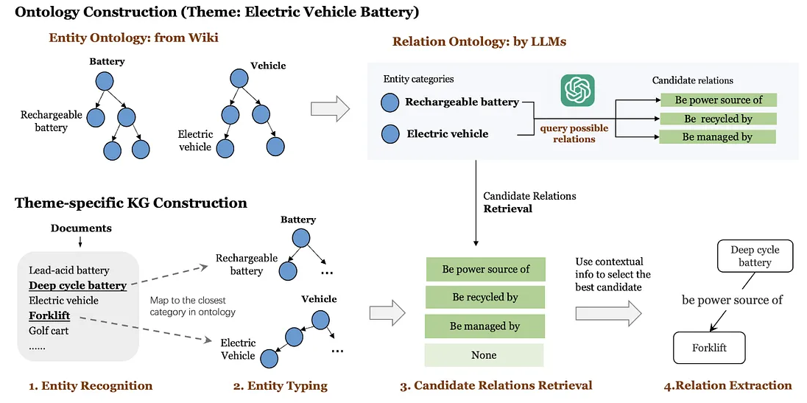

# KG CREATION PIPELINE

This is a tool that allows the creation of a robust ontology-based knowledge graph from unstrctured input. The knowledge graph will be stored in Neo4j.

## REFERENCES:

TKGCon: 
https://medium.com/@researchgraph/automated-knowledge-graph-construction-with-large-language-models-part-2-b107ca8ec5ea

Entity Resolution: 
https://towardsdatascience.com/entity-resolution-identifying-real-world-entities-in-noisy-data-3e8c59f4f41c

### GOALS
1. Multimodal input
2. Self-augmentation from user queries and automated web search
3. Agents and tools

### PROCESS

1. PDF to image extraction and generation of description in unstructured text
2. Text splitting and storage in local vector database
3. Creation of unrefined triples
3. Determination of themes
4. Ontology creation based on themes (Human in-the-loop)
5. Knowledge graph construction 
